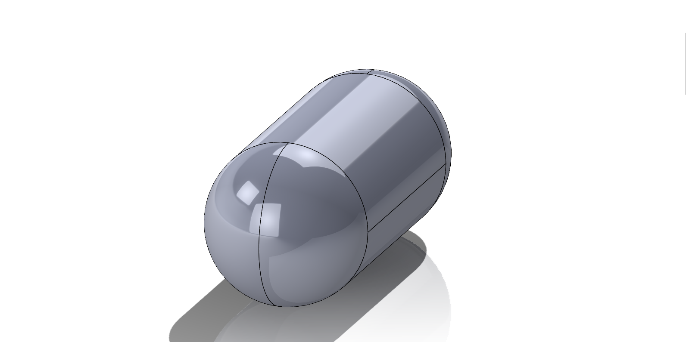
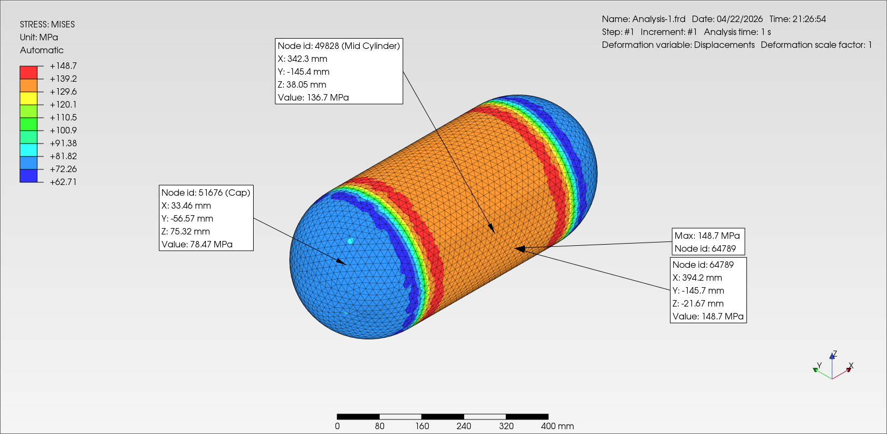
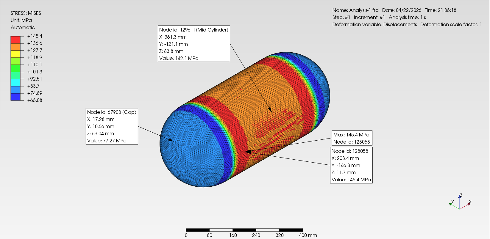
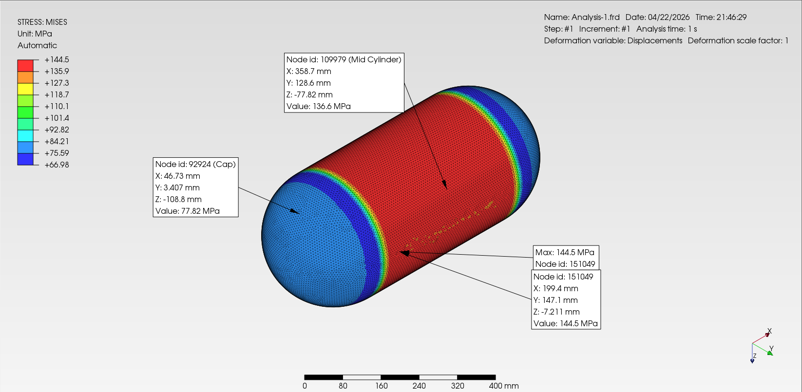

# Gas Vessel FEA — Structural Integrity Check

**Solver:** PrePoMax v2.5.1 dev / CalculiX | **Material:** Al 6061-T6 | **Element:** C3D10 (quadratic tetrahedral)

> Static linear FEA of a cylindrical propellant tank with hemispherical end caps under internal pressure. Includes hand calculation validation, mesh convergence study, and documented boundary condition rationale.

---

## Status

| Criterion | Limit | Result | Verdict |
|---|---|---|---|
| Von Mises — mid-cylinder | ≤ 137.91 MPa | 136.6 MPa | ✅ PASS |
| Von Mises — hemisphere body | ≤ 137.91 MPa | 77.82 MPa | ✅ PASS |
| Von Mises — junction (global max) | ≤ 137.91 MPa | 144.5 MPa | ❌ FAIL |
| Safety factor (SF ≥ 2.0) | ≥ 2.00 | 1.91 | ❌ FAIL |
| Radial displacement | ≤ 0.75 mm | 0.402 mm | ✅ PASS |
| Von Mises overshoot — junction vs limit | ≤ 5% | 4.8% | ✅ PASS |
| Mesh convergence | ≤ 2% | 0.62% | ✅ PASS |

**Overall:** STRUCTURAL CRITERIA NOT FULLY MET — SF = 1.91 at cylinder-to-hemisphere junction (target: 2.00). Wall thickness increase from 3 mm → ~3.2 mm would meet criterion. The solver is validated and the mesh is converged; this is a design margin finding, not a yield failure.

---

## Problem Statement

Does a cylindrical propellant tank with hemispherical end caps remain structurally safe under maximum operating pressure, with a safety factor of at least 2.0 against yield?

**Acceptance criterion:** $SF = \sigma_y / \sigma_{VM} \geq 2.0$ at all locations, evaluated at maximum operating pressure.  
**Standard invoked:** None — self-defined academic criterion, intentionally documented for reproducibility.

---

## Geometry & Load

| Parameter | Value |
|---|---|
| Inner radius (R) | 147 mm |
| Wall thickness (t) | 3 mm |
| Cylindrical section length | 400 mm |
| End cap type | Hemispherical (R_cap = R) |
| Total vessel length | 700 mm |
| R/t ratio | 49 (thin-wall valid, R/t > 10) |
| Operating pressure | 3.25 MPa (32.5 bar) |

### Geometry Image

| Gas Vessel |
|:---:|
|  |

**Pressure derivation:** Operating pressure was back-calculated from the SF = 2.0 criterion applied to von Mises stress in the cylindrical section:


$$\sigma_h = \frac{pR}{t}, \quad \sigma_a = \frac{pR}{2t}$$

$$\sigma_{VM} = \sqrt{\sigma_h^2 - \sigma_h \sigma_a + \sigma_a^2} = \frac{\sigma_y}{SF}$$

$$\therefore p = 3.25 \text{ MPa}$$

---

## Material — Al 6061-T6

| Property | Value |
|---|---|
| Young's modulus (E) | 68.9 GPa |
| Poisson's ratio (ν) | 0.33 |
| Yield strength ($$\sigma_y$$) | 276 MPa |
| Unit system | mm, tonne, s, °C (stress in MPa) |

---

## Boundary Conditions

Two hemisphere tip vertices — minimum constraint set to suppress all 6 rigid body modes without adding stiffness to the vessel wall.

| BC | Location | Constraints |
|---|---|---|
| BC1 | Hemisphere tip, X = 0 mm | U1 = U2 = U3 = 0 (pinned) |
| BC2 | Hemisphere tip, X = 700 mm | U2 = U3 = 0, U1 free |

> **Note:** An earlier version of this model used a fixed constraint at the cylinder-to-hemisphere junction edge. This was incorrect — the junction is the highest stress concentration zone, and fixing it there artificially stiffened the critical region, producing non-physical stress values (204.1 MPa). The corrected BC uses tip vertices only. See [Change Log](#change-log) for full details.

---

## Hand Calculations — Validation Baseline

### Thin-Walled Pressure Vessel Theory

For a thin-walled cylindrical vessel with hemispherical ends under internal pressure p:

**Hoop Stress (Cylinder):**

$$\sigma_h = \frac{pR}{t}$$

**Axial Stress (Cylinder):**

$$\sigma_a = \frac{pR}{2t}$$

**Von Mises Equivalent Stress (Cylinder):**

$$\sigma_{VM} = \sqrt{\sigma_h^2 + \sigma_a^2 - \sigma_h \sigma_a}$$

---

### Cylinder Mid-Section

**Given:**
- p = 3.25 MPa
- R = 147 mm (inner radius)
- t = 3 mm (wall thickness)
- R/t = 147/3 = 49 — thin-wall assumption valid (R/t > 10)

**Hoop Stress:**

$$\sigma_h = \frac{3.25 \times 147}{3} = 159.25 \text{ MPa}$$

**Axial Stress:**

$$\sigma_a = \frac{3.25 \times 147}{2 \times 3} = 79.63 \text{ MPa}$$

**Von Mises:**

$$\sigma_{VM} = \sqrt{159.25^2 + 79.63^2 - 159.25 \times 79.63}$$

$$= \sqrt{25360.56 + 6340.94 - 12681.98} = \sqrt{19019.52} = 137.91 \text{ MPa}$$

**Safety Factor:**

$$SF = \frac{\sigma_y}{\sigma_{VM}} = \frac{276}{137.91} = 2.00$$

---

### Hemispherical End Caps

For a hemisphere under internal pressure, stress is biaxial and equal in both directions:

**Membrane Stress:**

$$\sigma_{membrane} = \frac{pR}{2t} = \frac{3.25 \times 147}{2 \times 3} = 79.63 \text{ MPa}$$

**Von Mises = σ_membrane (biaxial equal stress cancels cross term):**

$$\sigma_{VM} = 79.63 \text{ MPa}$$

**Safety Factor:**

$$SF = \frac{276}{79.63} = 3.47$$

Caps are not the critical region. Hand calculations cannot predict junction stress — that requires FEA.

---

### Radial Displacement

| Quantity | Result | Limit (0.5% R) | Status |
|---|---|---|---|
| Max radial displacement | 0.402 mm | 0.750 mm | ✅ PASS (53.6% utilisation) |

---

## Mesh Convergence Study

| Mesh | Max Size | Min Size | Edges | Curvature | Nodes | Elements | Mid-cyl VM | Hemi VM | Global Max | SF | Δ from prev |
|---|---|---|---|---|---|---|---|---|---|---|---|
| Coarse | 15 mm | 5 mm | 3 | 5 | 44,087 | 22,131 | 136.7 MPa | 78.47 MPa | 148.7 MPa | 1.86 | baseline |
| Medium | 8 mm | 3 mm | 5 | 12 | 147,792 | 74,232 | 142.1 MPa | 77.27 MPa | 145.4 MPa | 1.90 | 2.22% |
| Fine | 6 mm | 1 mm | 6 | 12 | 264,007 | 132,628 | 136.6 MPa | 77.82 MPa | 144.5 MPa | **1.91** | **0.62%** ✅ |

Convergence criterion: ≤ 2% change between successive meshes. Met between medium and fine (0.62%). Fine mesh result governs all acceptance checks.

### Mesh Visualisations

| Coarse Mesh | Medium Mesh |
|:---:|:---:|
|  |  |

| Fine Mesh |
|:---:|
|  |

---

## FEA vs Hand Calculation Validation

| Location | Node | FEA | Hand Calc | Deviation | Status |
|---|---|---|---|---|---|
| Mid-cylinder | 109979 | 136.6 MPa | 137.91 MPa | −1.0% | ✅ |
| Hemisphere body | 92924 | 77.82 MPa | 79.63 MPa | −2.3% | ✅ |

Both probes are in the free-body region, away from BC artefacts. Agreement within 5% tolerance confirms the solver is working correctly.

The global maximum (144.5 MPa) at the cylinder-to-hemisphere junction is a 3D geometric effect that thin-wall theory cannot capture. This value is used for the acceptance check, not the hand calculation comparison.

---

## Modelling Assumptions & Limitations

| Assumption | Status | Notes |
|---|---|---|
| Static loading only | ✅ Justified | Proof-pressure check — not a fatigue or service-life check |
| Linear elastic behaviour | ✅ Justified | All stresses remain below yield at SF ≥ 1.91 |
| Uniform internal pressure | ✅ Justified | Standard for static structural integrity checks |
| No weld seams / ports / fittings | ⚠️ Noted | Stress concentration sources in real hardware |
| No fatigue assessment | ⚠️ Noted | Propellant tanks undergo repeated pressurisation cycles — single static event only |
| Self-defined SF = 2.0 criterion | ✅ Documented | No external standard (ECSS, NASA, ASME) invoked |

---

## Change Log

### BC Correction — April 21, 2026 (Critical)

| Item | Previous (Incorrect) | Corrected | Reason |
|---|---|---|---|
| BC location | Junction edge ring (cylinder-to-cap) | Two hemisphere tip vertices | Junction is highest stress zone — fixing it there corrupts results |
| Max stress (fine mesh) | 204.1 MPa | 144.5 MPa | Removed artificial stiffness at junction |
| Safety factor | 1.35 | 1.91 | Corrected max stress is the true structural response |
| Hand calc comparison | Hoop vs von Mises (invalid) | Von Mises vs von Mises, 4.8% (valid) | Like-for-like comparison requires same stress quantity |

---

## Repo Structure

```
gas-vessel-fea/
├── README.md               ← This file
├── images/
│   ├── mesh_coarse.png     ← Coarse mesh view
│   ├── mesh_medium.png     ← Medium mesh view
│   ├── mesh_fine.png       ← Fine mesh view
├── report/
│   └── PressureVessel_FEA_Final_v2.pdf
├── cad/
│   └── gas-vessel-geometry.SLDPRT
└── mesh/
    └── (PrePoMax .pmx model file)
```

---

## Tools

- **CAD:** SolidWorks 2022 SP2.0
- **FEA pre/post:** PrePoMax v2.5.1 dev
- **Solver:** CalculiX (C3D10 — 10-node quadratic tetrahedral)
- **Hand calculations:** Thin-wall pressure vessel theory (Lamé, von Mises)

---

*Prepared by Mark Lorenz Yamanaka — April 2026*
